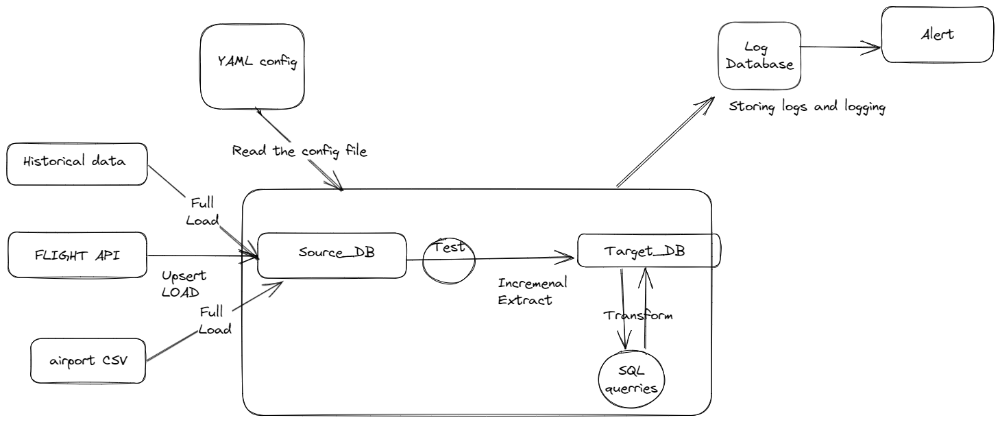

# flight_pipelines

# Project plan

## Objective

In the current project we aim to investigate which of the three selected airports (Washington DC / US, Krakow/EU, Tenerife/EU) is the most reliable one in terms of minimal flight delays. To compare these airports we are using the following relative metric: total number of inbound and outbound flights registered as being delayed at a given airport in relation to the total number of flights at a given airport (metric name: "percentage delayed flights"). To address this question we are sourcing live-updated flights statistics of the selected airports via the FlightRadar24 API in the course of several days. The API data are collected every 24h and stored in a database, where the analysis is performed. The comepetition between airports will be decided on the collected sample.

## Consumers

The intented consumer for the prepared data is a data analyst that will compare the flight statistics of the selected airports on the basis of the metric defined above. The data analyst will announce the winning airport on the basis of minimal percentage of delayed flights.

## Questions

The data analyst will be able to address the following questions (among others): 

+ Does the percentage of delayed flights (for arrivals and departures combined) differ between the three selected airports? 
+ Which airport is the most reliable on the basis of the defined metric?

## Source datasets

The flight statistics are sourced from a live flight tracking API (FlightRadar24) on a regular basis (data requested and updated every 24h).

## Solution architecture

How are we going to get data flowing from source to serving? What components and services will we combine to implement the solution? How do we automate the entire running of the solution?

The data flow is organized based on the three main steps of Extract-Load-Transform that define the overall pipeline:

#### EXTRACT

- send request for each airport (identified by IATA code) to API
- receive API response for a given airport, re-format (json-data) and select relevant data 
- loop over all selected airports and combine individual data-frames

#### LOAD

- define ORM model based on data types
- incremental loading to data base (appending data)

#### TRANSFORM

End consumer is data analyst:
- Load data from source to target database (  incremental load _
- renaming  column
- data quality test
- lowercase column name
- raw/staging/serving
data analyst should be able to find: 
- avr number of flights delayed for arrivals and departures?

#### Cloud-based Solution

+ ECR: uploading docker image of the pipeline

+ S3: uploading the evironment file conatining all secrets

+ ECS: creating a cluster running a EC2 instance

+  Define a scheduled task to request API data every 24h

## Setup

Follow below steps to setup pipeline.Feel free to make improvements/changes.

NOTE: This was developed using an Windows PC. If you're on Mac or Linux, you may need to amend certain components if issues are encountered.

As AWS offer a free tier, this shouldn't cost you anything unless you amend the pipeline to extract large amounts of data. please check AWS free tier limits, as this may change.

First clone the repository into your home directory and follow the steps.
make sure to follow config.template guide 

git clone https://github.com/mobmo423/flight_pipelines.git

python flights/pipeline/pipeline.py
